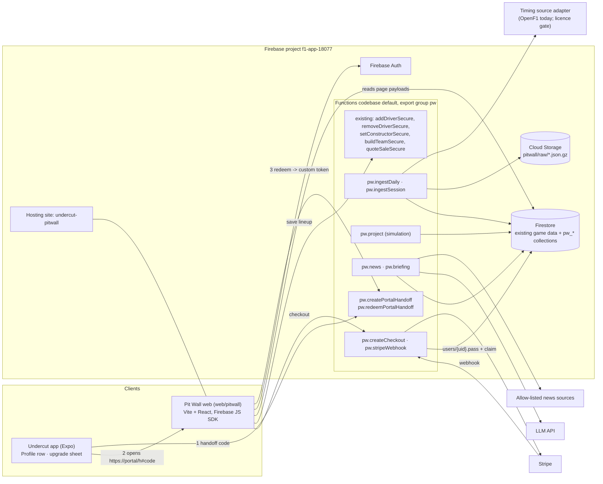

# Undercut Pit Wall — architecture

Premium web analytics portal for Undercut (root app). Everything here runs on infrastructure the project already has: the `f1-app-18077` Firebase project (Auth, Firestore, Functions on Node 22, Hosting, Secret Manager), the existing server-authoritative team callables, the `config/app` remote-config document, and `aidlc op` for every production change. New third parties: Stripe (web checkout) and an LLM API (briefings).

Features: F-075 shell, F-068 pass, F-069 pipeline, F-070 projections, F-071 news, F-072 reports, F-073 lineup lab, F-074 market and season (milestone M-09). Prototype: `prototype.html` in this folder (example data).

## 1. System overview



## 2. Hosting and domain

- `firebase.json` `hosting` becomes an array of two targets: the existing `public/` site (marketing, legal, `join`), unchanged, and a new site `undercut-pitwall` serving `web/pitwall/dist` with an SPA rewrite to `/index.html` and long-cache headers on hashed assets.
- Works immediately at `https://undercut-pitwall.web.app`. Custom domain `pitwall.humannpc.com` is an owner action (Cloudflare CNAME plus Firebase Hosting domain verification); add the domain to Firebase Auth authorized domains.
- Staging uses Hosting preview channels (`firebase hosting:channel:deploy`), no second project.
- New op kind `pitwall-hosting-deploy` in `.aidlc/aidlc.yaml` (`overrides.ops.kinds`): dry-run builds `web/pitwall` and prints the file diff, apply runs `scripts/ops/firebase-deploy.sh --only hosting:undercut-pitwall`.

## 3. Identity

One account everywhere: the portal uses the same Firebase Auth project, so teams, leagues and entitlements are already there.

- **Web sign-in:** email/password, Google and Apple popups. Amazon-login users arrive through the app handoff (they have no password).
- **App to web handoff (no second login):**
  1. App calls `pw.createPortalHandoff` (auth required). Server writes `pw_handoffs/{sha256(code)}` = `{ uid, expiresAt: now+60s, used: false, src }` and returns a 32-byte random code.
  2. App opens `https://<portal>/h#<code>&src=profile` in the system browser (`Linking.openURL`, not an in-app webview, so Google sign-in and saved cards work). The code is in the URL fragment so it never reaches server logs.
  3. Web calls `pw.redeemPortalHandoff({ code })`; server checks unused and unexpired, marks used in a transaction, returns a Firebase custom token; web runs `signInWithCustomToken`. The project already mints custom tokens for Amazon sign-in, so the service-account permission exists.
  - Rules: `pw_handoffs` has no client access. Redeem is rate-limited per IP and per code prefix.

## 4. Entitlement

- Source of truth: `users/{uid}.pass = { tier, season, expiresAt, source: 'stripe' | 'play' | 'apple' | 'grant' }`, written only by functions (rules deny client writes to `pass`).
- Mirror as a custom auth claim `pw: <expiresAt epoch>` so Firestore rules gate premium documents without an extra `get()` per read. The web calls `getIdToken(true)` after checkout; claims are re-stamped by a daily job and on every webhook.
- League Pro (`leagues/{id}.pro`, F-060) is separate. Members of a Pro league get a one-time 7-day pass trial (F-068).

## 5. Data model (new collections, prefix `pw_`)

Pages render from precomputed payloads, so a page view is 1 to 3 reads and no page ever runs a query fan-out.

| Collection | Doc id | Contents | Read access |
|---|---|---|---|
| `pw_public` | `{season}_{round}` | Teaser: briefing headlines, board top 10 with median only, wire headlines, data-as-of | any signed-in user |
| `pw_pages` | `{season}_{round}_{page}` | Full payload per page (board, circuit, pace, market, season, wire) | pass claim |
| `pw_entities` | `{season}_{round}_{entityId}` | Slide-over payload: past, present, outlook, tagged news | pass claim |
| `pw_projections` | `{season}_{round}_{sessionKey}` | Projection snapshot per refresh (movement chart, hindsight) | pass claim |
| `pw_news` | cluster id | Story clusters, tags, sources, review state | headlines public, body pass |
| `pw_runs` | run id | Pipeline run records, counts, gaps | admin |
| `pw_handoffs` | code hash | App to web sign-in codes | none |

- Raw laps, stints and pit data go to Cloud Storage (`pitwall/raw/{season}/{sessionKey}.json.gz`), not Firestore. Only derived aggregates are served.
- **Per-user views are computed in the browser** from a page payload plus documents the user can already read: their `fantasyTeams`, their league `members`, and league-mates' teams (already readable by league members). That covers Briefing recommendations, rivals' likely moves, the top pick and what-if in the Lineup Lab, exactly as the prototype does. No per-user server compute in v1; a `pw.optimize` callable comes later for the full optimizer.
- Existing collections reused read-only: `drivers`, `constructors`, `priceHistory`, `raceScores`, `races`, `articles`.

## 6. Pipeline (functions, export group `pw`)

Same functions codebase so `scoringCore.ts` and `updatePrices.ts` are imported directly and projections cannot drift from real scoring. New code lives in `functions/src/pitwall/` and is exported as one group (`export const pw = { ... }`) so it deploys with `--only functions:pw` and a portal deploy never touches scoring or lock functions.

| Function | Trigger | Does |
|---|---|---|
| `pw.ingestDaily` | schedule 06:00 UTC | Pull and backfill through the `TimingSource` adapter, write raw to Storage, aggregates to Firestore, run record |
| `pw.ingestSession` | 30 min after each session end (from the synced schedule) | Same, for one session, then enqueue `pw.project` |
| `pw.project` | task queue, 1 GiB, 540 s | 10,000-run simulation on `scoringCore`, price model on `updatePrices` rules, writes `pw_projections`, `pw_pages`, `pw_public`, `pw_entities` |
| `pw.news` | every 30 min | Extends today's `fetchNews`: allow-list, clustering, tagging |
| `pw.briefing` | daily and after sessions | LLM briefing and outlooks from numbers and tagged stories only, with the validation pass |
| `pw.createCheckout`, `pw.stripeWebhook` | callable, HTTPS | Stripe Checkout session; signature-verified, idempotent webhook |
| `pw.createPortalHandoff`, `pw.redeemPortalHandoff` | callable | Section 3 |

Secrets through `defineSecret`: `STRIPE_SECRET_KEY`, `STRIPE_WEBHOOK_SECRET`, `ANTHROPIC_API_KEY`. Deploys go through `aidlc op functions-deploy` (the Linux box deploys Undercut functions with the SA key and temporary ADC swap).

**What needs the data licence and what does not.** Frames built on our own game data (prices, value, ownership, rivals, hindsight, team value, lineup lab, recommendations) and on race classifications already stored in `raceScores` do not depend on the timing feed. Pace Lab, circuit history from laps, stint degradation and pit stop stats do. The build order in the handoff ships the first group first; the second group waits for the licensing decision recorded in `.aidlc/decisions/` (F-069 gate).

## 7. Lineup save from the browser

The web calls the same callables the app uses (`addDriverSecure`, `removeDriverSecure`, `setConstructorSecure`, `buildTeamSecure`, `quoteSaleSecure`, `lockTeam`/`checkLockStatus`). Budget, fees, contracts and locks stay server-authoritative; the web never writes `fantasyTeams`. The what-if runs locally, then "Save lineup" replays the diff as callable calls and shows the server's quote before confirming. Register a Web app in the Firebase console for App Check (reCAPTCHA Enterprise); the callables currently warn rather than reject without App Check, so the portal works before that is tightened.

## 8. In-app entry and upgrade promotion

All copy, placement and behaviour are server-driven so they can change, or be switched off, without a store build. New block in the existing `config/app` document, read by `remoteConfig.service.ts` (fail-open: missing block means nothing renders):

```json
"pitwall": {
  "enabled": true,
  "url": "https://pitwall.humannpc.com",
  "minAppVersion": "2.4.0",
  "profileRow": { "label": "PIT WALL", "free": "Upgrade", "pass": "Open" },
  "mode": { "android": "iap", "ios": "iap", "amazon": "open" },
  "surfaces": { "profile": true, "teamTeaser": true, "recapTeaser": true },
  "sheet": { "title": "SEE WHAT THE DATA SAYS", "benefits": ["...", "...", "..."], "cta": "GET PIT WALL PASS" },
  "capPerRound": 1
}
```

Surfaces, in order of build:

1. **Profile row.** A `LinkRow` under LEAGUE in `GridProfileScreen.tsx`: `PIT WALL` with `Upgrade` in red for free users (same accent treatment as `Join or create`) and `Open` for pass holders. Pass holders go straight to the portal through the handoff. Free users get the upgrade sheet.
2. **Upgrade sheet.** Grid bottom sheet (same pattern as the avatar sheet): title, three benefits, one screenshot of the Briefing, price, primary CTA, and a secondary `PREVIEW FREE` that opens the portal's teaser through the handoff.
3. **Team screen teaser.** One mono line under the stat row, only when a lineup exists and the round is unlocked: `PIT WALL · 3 MOVES COULD ADD +17`. The number is real, computed from `pw_public` plus the user's lineup. Tap opens the sheet.
4. **Weekend recap teaser.** In `GridWeekendRecap`: `THE BEST LINEUP SCORED 412. SEE WHERE YOURS LOST POINTS →`.

Rules for promotion: never before the user has a lineup, never blocks a game action, at most `capPerRound` impressions per surface per round (AsyncStorage), and every open carries `src=` so the funnel (impression, sheet, teaser open, checkout, paid) is measurable per surface.

**Store policy.** `mode` is per platform because the rules differ and change:
- `iap`: the sheet sells the pass through the store's in-app purchase (needs F-060/F-061, which bring the purchase library back). No mention of web pricing in the app.
- `open`: the sheet has no price and no purchase wording; the CTA opens the portal. Use on Amazon, and on Play/iOS until IAP is back.
- `off`: surface hidden.
Whether an in-app link may point at a site that sells the pass depends on storefront (the US rules differ from the rest of the world on both stores). Treat that as a release-time check in F-068, and default to `open` with neutral copy if unsure.

## 9. Security and privacy

- Rules tests (`rules-tests/`) for: `pass` field and `pw` claim not client-writable, `pw_pages`/`pw_entities` unreadable without the claim, `pw_handoffs` closed, web client cannot write `fantasyTeams`.
- Rival views show only what the app already shows league members.
- LLM inputs contain no personal data. Penalty and injury items pass an admin review queue before showing as confirmed.
- `.aidlc/data-safety.yaml` and the privacy policy gain: Stripe customer id, pass status, portal preferences.
- Trademark: the portal, its pages and the pass carry no watchlist term; footer carries the unofficial disclaimer.

## 10. Cost at launch scale (hundreds of users)

Hosting and Auth: free tier. Firestore: about 12 reads per page view. Functions: one daily run, about 8 session runs and 8 simulations per race weekend. LLM: capped at $40 per month with a budget alert. Stripe: 2.9% + 30c per sale, no monthly fee. Expected total under $60 per month before revenue.
