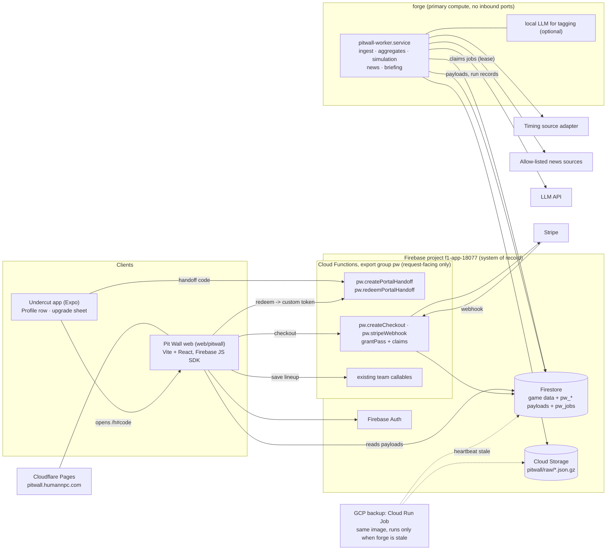

# Undercut Pit Wall — architecture

Premium web analytics portal for Undercut (root app). Everything here runs on infrastructure the studio already has, split by what each is good at (owner decision, 2026-09-19):

- **Cloudflare** serves the site at `pitwall.humannpc.com` (humannpc.com is already on Cloudflare and set up well).
- **forge** (the studio's Linux box: 32 cores, 62 GB, RTX 3080 Ti) does the heavy compute, as it already does for other studio products, with a **GCP backup runner** for when forge is down.
- **Firebase project `f1-app-18077`** stays the system of record: Auth, Firestore, and a small set of Cloud Functions for the things that must answer requests (sign-in handoff, checkout, webhook, the existing team callables).
- `config/app` remote config and `aidlc op` for every production change, as today. New third parties: Stripe (web checkout) and an LLM API (briefings).

Features: F-075 shell, F-068 pass, F-069 pipeline, F-070 projections, F-071 news, F-072 reports, F-073 lineup lab, F-074 market and season (milestone M-09). Prototype: `prototype.html` in this folder (example data).

## 1. System overview



## 2. Hosting and domain

- **`pitwall.humannpc.com` on Cloudflare Pages.** The zone is already on Cloudflare, so the custom domain is a Pages setting, not a DNS project. Static SPA build from `web/pitwall/dist`, SPA fallback to `/index.html`, immutable cache headers on hashed assets (`_headers`), security headers and a CSP that allows only Firebase, Stripe and Google Fonts.
- **Deploys are gated, not automatic.** New op kind `pitwall-pages-deploy` in `.aidlc/aidlc.yaml`: dry-run builds `web/pitwall` and lists the changed files, apply runs `wrangler pages deploy web/pitwall/dist --project-name undercut-pitwall --branch main`. Every branch deploy gets a Pages preview URL, which is the staging environment.
- Firebase Hosting keeps serving the existing `public/` site (`undercut.humannpc.com`: legal pages, `join`). It is not used for the portal.
- Firebase Auth: add `pitwall.humannpc.com` (and the Pages preview domain while testing) to the authorized domains, and register a Web app for the portal config and App Check.
- Transactional email (receipts, alerts) sends from the humannpc.com domain through the Resend account already used for Track Limits.

## 3. Identity

One account everywhere: the portal uses the same Firebase Auth project, so teams, leagues and entitlements are already there.

- **Web sign-in:** email/password, Google and Apple popups. Amazon-login users arrive through the app handoff (they have no password).
- **App to web handoff (no second login):**
  1. App calls `pw.createPortalHandoff` (auth required). Server writes `pw_handoffs/{sha256(code)}` = `{ uid, expiresAt: now+60s, used: false, src }` and returns a 32-byte random code.
  2. App opens `https://<portal>/h#<code>&src=profile` in the system browser (`Linking.openURL`, not an in-app webview, so Google sign-in and saved cards work). The code is in the URL fragment so it never reaches server logs.
  3. Web calls `pw.redeemPortalHandoff({ code })`; server checks unused and unexpired, marks used in a transaction, returns a Firebase custom token; web runs `signInWithCustomToken`. The project already mints custom tokens for Amazon sign-in, so the service-account permission exists.
  - Rules: `pw_handoffs` has no client access. Redeem is rate-limited per IP and per code prefix.

## 4. Entitlement

- Source of truth: `users/{uid}.pass = { tier, season, expiresAt, source: 'stripe' | 'play' | 'apple' | 'grant' }`, written only by functions (rules deny client writes to `pass`).
- Mirror as a custom auth claim `pw: <expiresAt epoch>` so Firestore rules gate premium documents without an extra `get()` per read. The web calls `getIdToken(true)` after checkout; claims are re-stamped by a daily job and on every webhook.
- One product, one grant path: Stripe webhook and store `validatePurchase` both call `grantPass(uid, season, source)`. `grantPass` also stamps `leagues/{id}.pro` on every league the user owns (League Pro is derived, never bought; F-060); a trigger covers leagues created later and ownership transfers. Members of a Pro league get a one-time 7-day portal trial (F-068).
- Price: $14.99 per season, no monthly plan (ADR-001).

## 5. Data model (new collections, prefix `pw_`)

Pages render from precomputed payloads, so a page view is 1 to 3 reads and no page ever runs a query fan-out.

| Collection | Doc id | Contents | Read access |
|---|---|---|---|
| `pw_public` | `{season}_{round}` | Free look: briefing headlines, board top 10 with median only, wire headlines, Rate My Team inputs, data-as-of | any signed-in user |
| `pw_public_timing` | `{season}_{round}_{frame}` | Every timing-derived frame (Pace Lab, circuit lap history, pit stops, stint degradation). Free only, never read by pass-gated builders (ADR-001) | any signed-in user |
| `pw_pages` | `{season}_{round}_{page}` | Full payload per page (board, circuit, pace, market, season, wire) | pass claim |
| `pw_entities` | `{season}_{round}_{entityId}` | Slide-over payload: past, present, outlook, tagged news | pass claim |
| `pw_projections` | `{season}_{round}_{sessionKey}` | Projection snapshot per refresh (movement chart, hindsight) | pass claim |
| `pw_news` | cluster id | Story clusters, tags, sources, review state | headlines public, body pass |
| `pw_runs` | run id | Pipeline run records, counts, gaps | admin |
| `pw_handoffs` | code hash | App to web sign-in codes | none |
| `pw_jobs` | job id | Work queue for the forge worker and the GCP backup: kind, round, lease owner and expiry, attempts | none (Admin SDK only) |

- Raw laps, stints and pit data go to Cloud Storage (`pitwall/raw/{season}/{sessionKey}.json.gz`), not Firestore. Only derived aggregates are served.
- **Per-user views are computed in the browser** from a page payload plus documents the user can already read: their `fantasyTeams`, their league `members`, and league-mates' teams (already readable by league members). That covers Briefing recommendations, rivals' likely moves, the top pick and what-if in the Lineup Lab, exactly as the prototype does. No per-user server compute in v1; a `pw.optimize` callable comes later for the full optimizer.
- Existing collections reused read-only: `drivers`, `constructors`, `priceHistory`, `raceScores`, `races`, `articles`.

## 6. Compute: forge first, GCP as backup

Heavy work runs on **forge**, following the pattern the studio already uses for its other products: a systemd service that pulls jobs from Firestore, holds no inbound ports, and can be restarted at any time. Cloud Functions are kept for the few things that must answer a request.

**What runs where**

| Work | Where | Why |
|---|---|---|
| Timing and results ingest, aggregates, backfills | forge worker | Long-running, bursty, free on forge |
| Projection simulation and backtests | forge worker | 32 cores: 10,000 runs per refresh is the floor, 100,000 is affordable |
| News ingest, clustering, tagging | forge worker | Tagging can use the local model on the GPU; no per-call cost |
| Daily briefing and Outlook text | forge worker calling the LLM API | Quality matters here; capped spend |
| Payload publishing (`pw_public`, `pw_public_timing`, `pw_pages`, `pw_entities`, `pw_projections`) | forge worker | Written with the Admin SDK |
| Sign-in handoff, Stripe checkout and webhook, `grantPass`, auth claims | Cloud Functions group `pw` | Must be reachable and always on |
| Lineup save | existing team callables | Unchanged, server-authoritative |

**The worker**

- Code in `workers/pitwall/` (Node 22, TypeScript) in this repo. It imports `functions/src/scoring/scoringCore.ts` and the price rules from `functions/src/pricing/updatePrices.ts` directly, so projections cannot drift from real scoring; a test asserts identical points on a fixture result.
- Jobs are documents in `pw_jobs` (`kind`, `round`, `sessionKey`, `status`, `leaseOwner`, `leaseUntil`, `attempts`). A runner claims a job in a transaction, renews the lease while it works and writes a run record to `pw_runs`. Expired leases are reclaimed. Every job is idempotent on `(kind, round, sessionKey)`.
- Schedule: systemd timers on forge enqueue the daily job (06:00 UTC) and the session jobs (30 minutes after each session end, from the synced schedule). Enqueueing is itself idempotent, so a missed timer can be replayed.
- Raw data: Cloud Storage is the source of truth (`pitwall/raw/{season}/{sessionKey}.json.gz`) with a local cache on forge, so the backup runner has everything it needs.
- Secrets on forge live in an env file outside the repo (`/etc/pitwall-worker.env`, mode 600). The worker uses its own service account, not the deploy key.

**Deploying to forge safely.** On this box a service that runs from a working tree runs whatever branch is checked out, so a `git checkout` becomes a silent production deploy (this has already bitten another product here). The Pit Wall worker therefore **never runs from `/data/f1-app`**, where sessions switch branches all day. It runs from a dedicated deploy checkout, `/data/pitwall-worker`, that only the deploy op touches: op kind `pitwall-worker-deploy` fetches `master` at a named commit, runs `npm ci` and the build, runs the worker tests, then `sudo -n systemctl restart pitwall-worker`. Dry-run prints the commit range and test results.

**GCP backup.** The same code is built into a container image (`workers/pitwall/Dockerfile`, Cloud Build, Artifact Registry) and registered as a **Cloud Run Job**. Cloud Scheduler runs a small watchdog every 30 minutes on race weekends and every 6 hours otherwise: if there are due jobs and forge's heartbeat in `pw_runs` is stale, it starts the Cloud Run Job, which claims jobs through the same lease. Because claims are leased, forge and the backup can never process the same job twice; this is the same race that forced another product to retire a duplicate poller, designed out here from the start. Secrets for the backup come from Secret Manager. The backup idles at zero cost.

**Platform-wide use.** Nothing here is a new platform. The job and lease convention, the dedicated deploy checkout, the env-file secrets and the Cloud Run backup are written up in `workers/README.md` so the next studio product can reuse them, but the Pit Wall worker ships as a self-contained service.

Cloud Functions in the `pw` group deploy with `--only functions:pw` through `aidlc op functions-deploy`, so a portal deploy never touches scoring or lock functions. Secrets there use `defineSecret`: `STRIPE_SECRET_KEY`, `STRIPE_WEBHOOK_SECRET`.

**Paid runs on our data, timing stays free (ADR-001).** Pass features (projections, recommendations, rivals, lineup lab, market, season, deep dives) are built only from our own game data and the race classifications in `raceScores`. Timing-derived frames are written to `pw_public_timing`, shown to every signed-in user, and a unit test stops any pass-gated builder or the projection model from reading them. `config/app.pitwall.timingFrames` hides them without a deploy.

## 7. Lineup save from the browser

The web calls the same callables the app uses (`addDriverSecure`, `removeDriverSecure`, `setConstructorSecure`, `buildTeamSecure`, `quoteSaleSecure`, `lockTeam`/`checkLockStatus`). Budget, fees, contracts and locks stay server-authoritative; the web never writes `fantasyTeams`. The what-if runs locally, then "Save lineup" replays the diff as callable calls and shows the server's quote before confirming. Register a Web app in the Firebase console for App Check (reCAPTCHA Enterprise); the callables currently warn rather than reject without App Check, so the portal works before that is tightened.

## 8. In-app entry and upgrade promotion

All copy, placement and behaviour are server-driven so they can change, or be switched off, without a store build. New block in the existing `config/app` document, read by `remoteConfig.service.ts` (fail-open: missing block means nothing renders):

```json
"pitwall": {
  "enabled": true,
  "beta": { "uids": [], "leagueIds": [] },
  "timingFrames": true,
  "url": "https://pitwall.humannpc.com",
  "minAppVersion": "2.4.0",
  "profileRow": { "label": "PIT WALL", "free": "Upgrade", "pass": "Open" },
  "mode": { "android": "open", "ios": "open", "amazon": "open" },
  "surfaces": { "profile": true, "teamTeaser": true, "recapTeaser": true },
  "sheet": { "title": "SEE WHAT THE DATA SAYS", "benefits": ["...", "...", "..."], "cta": "GET PIT WALL PASS" },
  "capPerRound": 1
}
```

Surfaces, in order of build:

1. **Profile row.** A `LinkRow` under LEAGUE in `GridProfileScreen.tsx`: `PIT WALL` with `Upgrade` in red for free users (same accent treatment as `Join or create`) and `Open` for pass holders. Pass holders go straight to the portal through the handoff. Free users get the upgrade sheet.
2. **Upgrade sheet.** Grid bottom sheet (same pattern as the avatar sheet): title, three benefits, one screenshot of the Briefing, price, primary CTA, and a secondary `PREVIEW FREE` that opens the portal's teaser through the handoff.
3. **Team screen teaser.** One mono line under the stat row, only when a lineup exists and the round is unlocked: `PIT WALL · 3 MOVES COULD ADD +17`. The number is real, computed from `pw_public` plus the user's lineup. Tap opens the sheet.
4. **Weekend recap teaser.** In `GridWeekendRecap`: `THE BEST LINEUP SCORED 412. SEE WHERE YOURS LOST POINTS →`.

Rules for promotion: never before the user has a lineup, never blocks a game action, at most `capPerRound` impressions per surface per round (AsyncStorage), and every open carries `src=` so the funnel (impression, sheet, teaser open, checkout, paid) is measurable per surface.

**Store policy.** `mode` is per platform because the rules differ and change:
- `iap`: the sheet sells the pass through the store's in-app purchase (needs F-060/F-061, which bring the purchase library back; planned for the February 2027 release). No mention of web pricing in the app.
- While `beta` is non-empty, surfaces render only for listed users and members of listed leagues.
- `open`: the sheet has no price and no purchase wording; the CTA opens the portal. Use on Amazon, and on Play/iOS until IAP is back.
- `off`: surface hidden.
Whether an in-app link may point at a site that sells the pass depends on storefront (the US rules differ from the rest of the world on both stores). Treat that as a release-time check in F-068, and default to `open` with neutral copy if unsure.

## 9. Security and privacy

- Rules tests (`rules-tests/`) for: `pass` field and `pw` claim not client-writable, `pw_pages`/`pw_entities` unreadable without the claim, `pw_handoffs` closed, web client cannot write `fantasyTeams`.
- Rival views show only what the app already shows league members.
- LLM inputs contain no personal data. Penalty and injury items pass an admin review queue before showing as confirmed.
- `.aidlc/data-safety.yaml` and the privacy policy gain: Stripe customer id, pass status, portal preferences.
- Trademark: the portal, its pages and the pass carry no watchlist term; footer carries the unofficial disclaimer.

## 10. Cost at launch scale (hundreds of users)

Cloudflare Pages: free tier. Firebase Auth: free tier. Firestore: about 12 reads per page view plus payload writes per refresh. Compute: forge, no marginal cost; the Cloud Run backup idles at zero. Cloud Functions: only handoff, checkout and webhook calls. LLM: capped at $40 per month with a budget alert, lower if tagging runs on the local model. Stripe: 2.9% + 30c per sale, no monthly fee. Expected total under $50 per month before revenue.
